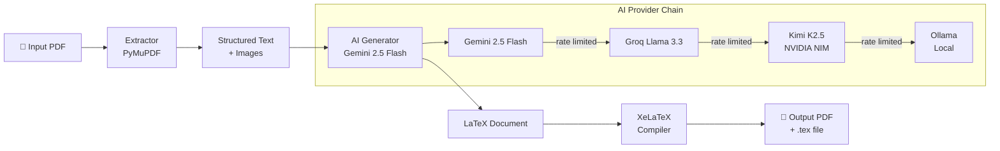

# Docstream

> AI-powered PDF to LaTeX conversion library

[](https://pypi.org/project/docstream/)
[](https://www.python.org/)
[](LICENSE)
[]()

**Docstream** converts PDFs into publication-quality LaTeX documents using AI. Feed it a research paper, thesis, or report — it extracts content, structures it intelligently, generates clean LaTeX via a multi-provider AI chain, and compiles it to PDF with XeLaTeX.

Built for researchers, academics, and developers who need reliable PDF→LaTeX conversion without manual reformatting.

---

## ✨ Features

- **PDF to LaTeX in 3 steps** — extract, generate, compile
- **IEEE & academic report templates** — conference-ready or single-column report
- **Multi-provider AI fallback chain** — Gemini 2.5 Flash → Groq Llama 3.3 → Kimi K2.5 (NVIDIA NIM) → Ollama (local)
- **Image extraction & figure placement** — diagrams and figures preserved
- **Citation & bibliography handling** — reference blocks extracted and formatted
- **XeLaTeX compilation** — produces a real, compilable `.tex` + `.pdf`
- **Python 3.10+ compatible**

---

## 🚀 Quick Start

### Installation

```bash
pip install docstream
```

### Basic Usage

```python
import docstream

result = docstream.convert(
    "paper.pdf",
    template="report",  # or "ieee"
    output_dir="./output"
)

if result.success:
    print(f"LaTeX: {result.tex_path}")
    print(f"PDF:   {result.pdf_path}")
    print(f"Time:  {result.processing_time}s")
```

### API Keys

Create a `.env` file in your project root:

```env
GEMINI_API_KEY=your_gemini_api_key_here
GROQ_API_KEY=your_groq_api_key_here
NVIDIA_API_KEY=your_nvidia_api_key_here
OLLAMA_BASE_URL=http://localhost:11434
```

> All providers are optional — Docstream falls back automatically if one is unavailable. Gemini free tier (1,500 req/day) is recommended as the primary provider.

---

## 🏗️ Architecture


```
┌──────────────────────────────────────────────────────────────────────────┐
│  Input PDF → Extractor (PyMuPDF) → Structured Text + Images             │
│           → AI Generator (Gemini 2.5 Flash) → LaTeX Document            │
│           → XeLaTeX Compiler → Output PDF + .tex file                   │
└──────────────────────────────────────────────────────────────────────────┘

AI Provider Chain (automatic fallback):
  Gemini 2.5 Flash ──rate limited──▶ Groq Llama 3.3
                                         │ rate limited
                                         ▼
                               Kimi K2.5 (NVIDIA NIM)
                                         │ rate limited
                                         ▼
                                   Ollama (Local)
```

<details>
<summary>View Mermaid source</summary>



</details>

---

## 📖 API Reference

### `convert()`

```python
docstream.convert(
    pdf_path: str | Path,
    template: str = "report",
    output_dir: str | Path = "./docstream_output",
    ai_provider = None,
) -> ConversionResult
```

| Parameter | Type | Default | Description |
|-----------|------|---------|-------------|
| `pdf_path` | `str \| Path` | — | Path to input PDF |
| `template` | `str` | `"report"` | `"report"` or `"ieee"` |
| `output_dir` | `str \| Path` | `"./docstream_output"` | Output directory |
| `ai_provider` | `AIProvider \| None` | `None` | Custom provider (uses fallback chain if `None`) |

**`ConversionResult` fields:**

| Field | Type | Description |
|-------|------|-------------|
| `success` | `bool` | Whether conversion succeeded |
| `tex_path` | `Path` | Path to generated `.tex` file |
| `pdf_path` | `Path` | Path to compiled `.pdf` file |
| `processing_time` | `float` | Seconds taken |
| `template_used` | `str` | Template that was applied |
| `error` | `str \| None` | Error message if `success=False` |

---

### `extract()`

```python
docstream.extract(pdf_path: str | Path) -> dict
```

Extracts structured content from a PDF without AI processing. Returns a document dict with `title`, `authors`, `abstract`, `sections`, `references`, and `images`.

---

### `generate()`

```python
docstream.generate(
    document: dict,
    template: str,
    ai_provider = None,
) -> str
```

Generates LaTeX source from a structured document dict. Returns the complete LaTeX string.

---

## 🎨 Templates

| Template | Document Class | Layout | Use Case |
|----------|---------------|--------|----------|
| `report` | `article` (12pt) | Single column | Academic reports, theses, tech docs |
| `ieee` | `IEEEtran` | Two column | IEEE conference & journal papers |

---

## ⚙️ Configuration

| Variable | Required | Description |
|----------|----------|-------------|
| `GEMINI_API_KEY` | Recommended | Google Gemini API key (primary provider) |
| `GROQ_API_KEY` | Optional | Groq fallback provider |
| `NVIDIA_API_KEY` | Optional | Kimi K2.5 via NVIDIA NIM |
| `OLLAMA_BASE_URL` | Optional | Local Ollama server (default: `http://localhost:11434`) |
| `DOCSTREAM_LOG_LEVEL` | Optional | Logging verbosity (default: `INFO`) |

**Getting API keys (all free tiers available):**
- **Gemini:** [aistudio.google.com/app/apikey](https://aistudio.google.com/app/apikey) — 1,500 req/day free
- **Groq:** [console.groq.com/keys](https://console.groq.com/keys) — generous free tier
- **NVIDIA NIM:** [build.nvidia.com](https://build.nvidia.com) — free credits on signup

---

## 🔧 Development

### Prerequisites

- Python 3.10+
- XeLaTeX: `sudo apt install texlive-xetex texlive-latex-extra texlive-fonts-recommended`
- [`uv`](https://github.com/astral-sh/uv) (recommended): `pip install uv`

### Setup

```bash
git clone https://github.com/YashKasare21/docstream
cd docstream
uv sync
cp .env.example .env
# Add your API keys to .env
```

### Running Tests

```bash
pytest tests/ -v
```

### Project Structure

```
docstream/
├── core/
│   ├── extractor_v2.py       # PDF text + image extraction (PyMuPDF)
│   ├── generator.py          # AI LaTeX generation
│   ├── compiler.py           # XeLaTeX compilation
│   ├── ai_provider.py        # Multi-provider AI fallback chain
│   ├── semantic_analyzer.py  # Document type detection
│   ├── template_matcher.py   # Template field mapping
│   └── quality_checker.py    # Output validation
├── templates/
│   └── skeletons/
│       ├── ieee.tex                   # IEEE template skeleton
│       ├── report.tex                 # Report template skeleton
│       ├── ieee_instructions.txt      # AI generation instructions
│       └── report_instructions.txt
├── exceptions.py
└── __init__.py               # Public API surface
```

---

## 🤝 Contributing

Contributions are welcome! Please:

1. Fork the repository
2. Create a feature branch (`git checkout -b feature/your-feature`)
3. Add tests for new functionality
4. Run `pytest tests/ -v` and ensure all pass
5. Submit a pull request

See [CONTRIBUTING.md](CONTRIBUTING.md) for detailed guidelines.

---

## 📋 Roadmap

- [ ] Resume / CV template
- [ ] DOCX input support
- [ ] Image-based PDF (full OCR) support
- [ ] PPTX input support
- [ ] Async `convert()` API
- [ ] Better figure caption extraction
- [ ] More templates (Springer, ACM)

---

## 📄 License

MIT License — see [LICENSE](LICENSE) for details.

---

## 👤 Author

**Yash Kasare**
- GitHub: [@YashKasare21](https://github.com/YashKasare21)
- Email: yashnkasare16@gmail.com

---

*If Docstream saves you time, consider giving it a ⭐ on GitHub!*
